# Nyx Hotel Reservation System

A hotel reservation platform developed through a collaboration between Informatics and Hotel Management students at Universitas Multimedia Nusantara (UMN).

This project was created as part of the **IF351 Database Systems** and **IF451 Advanced Web Programming** courses, combining database engineering, full-stack web development, and hospitality business workflows into a complete reservation management platform.

The system was designed to simulate real-world hotel operations by providing an integrated environment where guests can browse rooms, make reservations, manage bookings, complete payments, and access invoices, while administrators can manage rooms, reservations, services, and customer information through a centralized dashboard.

---

# Why We Built This Project

Hotel reservation systems involve multiple interconnected processes such as room availability management, booking validation, payment tracking, invoice generation, and customer services.

Through discussions and collaboration with students from the Hotel Management program, our team identified common operational workflows found in hospitality businesses and translated them into a web-based reservation platform.

Beyond fulfilling academic requirements, this project allowed us to explore how relational and non-relational databases can work together within a modern full-stack application while addressing practical business needs in the hospitality industry.

---

# Key Features

### Guest Features

- User Registration & Authentication
- Profile Management
- Room Browsing & Availability Checking
- Hotel Reservation System
- Shopping Cart Management
- Payment Processing
- Booking Confirmation
- Booking History
- Invoice Generation
- Responsive User Interface

### Administrative Features

- Admin Dashboard
- Room Management
- Reservation Management
- Customer Management
- Payment Monitoring
- Service Management
- Invoice Monitoring
- Operational Data Management

---

# Demo Preview

## 1. Home Page

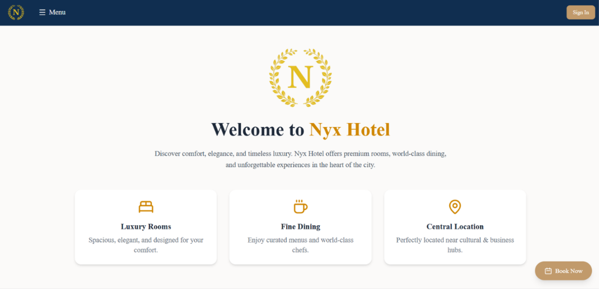

---

## 2. Login & Register Page

<p align="center">
  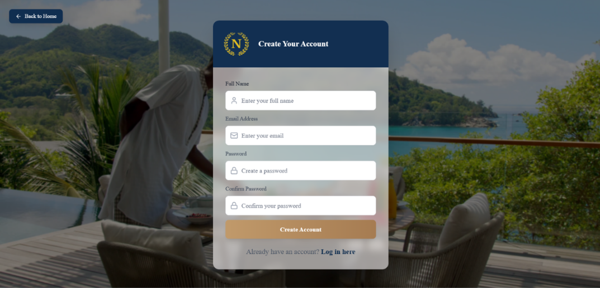
  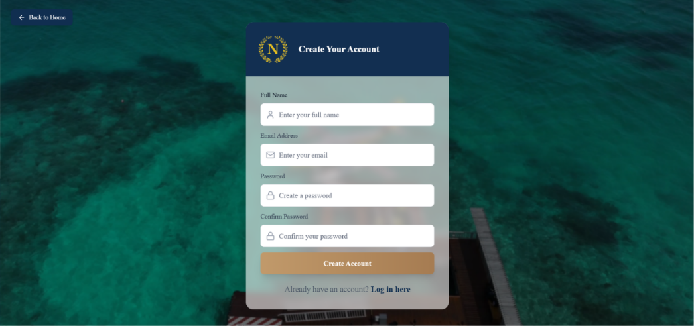
</p>

---

## 3. Profile Page

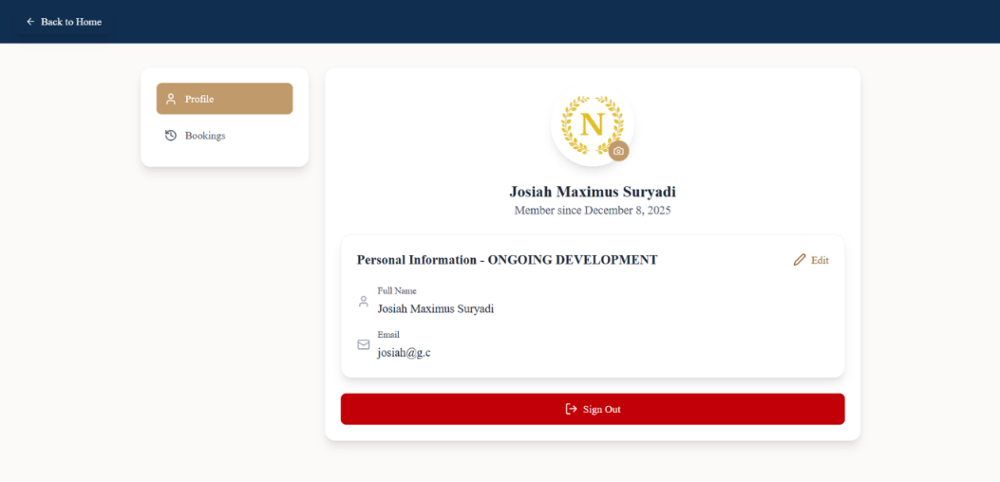

---

## 4. Booking Page

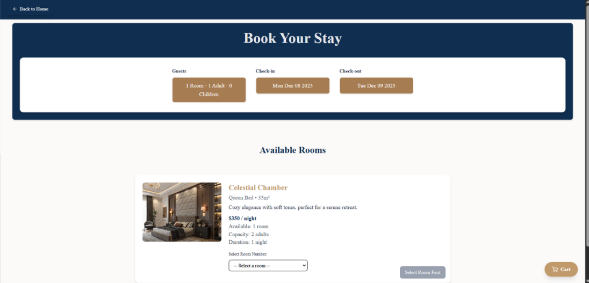

---

## 5. Cart Page

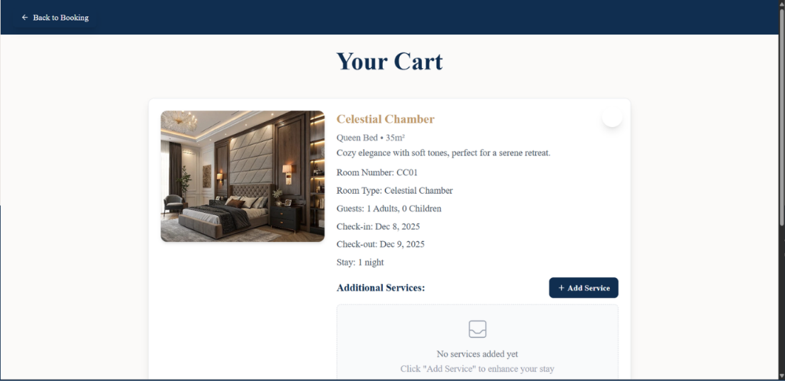

---

## 6. Payment Page

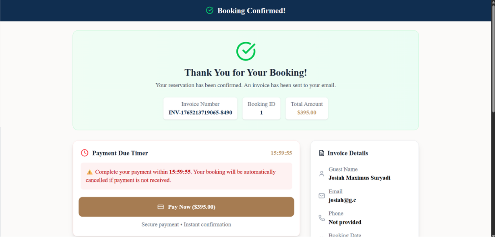

---

## 7. Booked Page

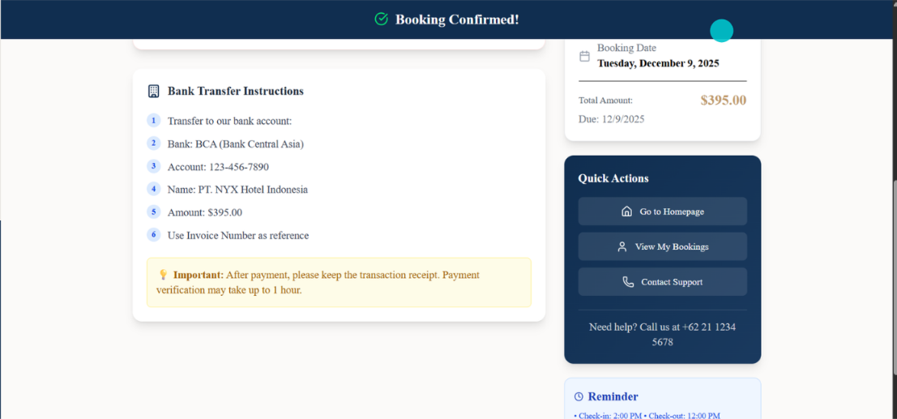

---

## 8. My Bookings Page

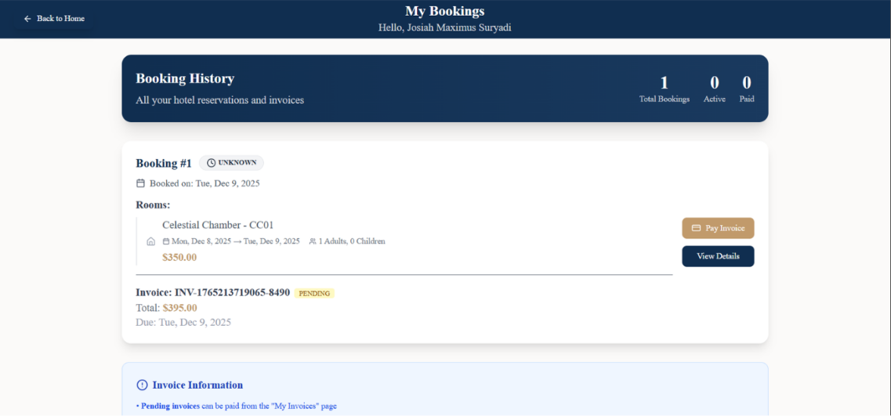

---

## 9. Invoice Page

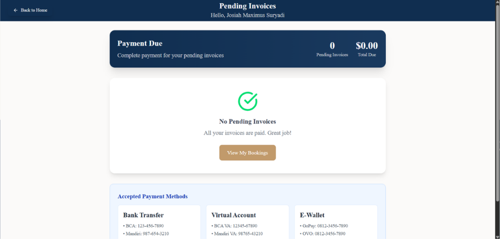

---

## 10. Admin Dashboard

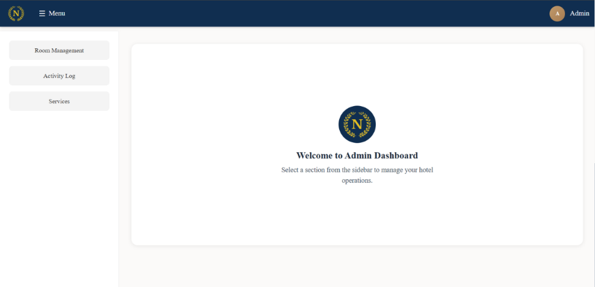

---

# Tech Stack

## Frontend

- React.js
- Vite
- Tailwind CSS
- Framer Motion

## Backend

- Node.js
- Express.js

## Database

- MySQL
- MongoDB

## Authentication

- JWT (JSON Web Token)

## Deployment

- Hostinger

---

# Database Implementation

One of the primary goals of this project was to implement concepts learned throughout the Database Systems course in a practical environment.

The application utilizes both relational and non-relational databases:

### MySQL

Used for structured transactional data, including:

- Users
- Rooms
- Reservations
- Payments
- Services
- Invoices

### MongoDB

Used for document-oriented storage and experimentation with NoSQL database concepts.

This hybrid database architecture allowed the team to compare and apply different data modeling approaches within a single application.

---

# Collaboration

This project was developed through a collaboration between:

- Informatics Study Program Students
- Hotel Management Study Program Students

The Hotel Management team contributed operational knowledge, hospitality workflows, and business requirements, while the Informatics team focused on database design, system architecture, backend development, frontend implementation, and deployment.

This collaboration helped ensure that the final system reflects both technical requirements and real hospitality industry practices.

---

# Project Structure

```text
project/
│
├── client/
│   ├── src/
│   ├── public/
│   └── package.json
│
├── server/
│   ├── routes/
│   ├── controllers/
│   ├── models/
│   ├── middleware/
│   └── package.json
│
├── screenshots/
│
└── README.md
```

---

# Installation

## Clone Repository

```bash
git clone https://github.com/yourusername/nyx-hotel-reservation-system.git

cd nyx-hotel-reservation-system
```

---

## Backend Setup

```bash
cd server

npm install
```

Create `.env`

```env
PORT=5000

DB_HOST=your_host
DB_USER=your_username
DB_PASSWORD=your_password
DB_NAME=your_database

JWT_SECRET=your_secret
```

Run backend:

```bash
npm run dev
```

---

## Frontend Setup

```bash
cd client

npm install
```

Run frontend:

```bash
npm run dev
```

---

# Academic Outcomes

Through this project, our team gained practical experience in:

- Relational Database Design
- NoSQL Database Modeling
- REST API Development
- Authentication & Authorization
- Full Stack Web Development
- React & Vite Development
- Database Integration
- Hospitality System Analysis
- Cross-Disciplinary Collaboration
- Software Documentation

---

# Course Information

### IF351 - Database Systems

Focused on database modeling, SQL implementation, normalization, and database architecture.

### IF451 - Advanced Web Programming

Focused on modern web development, backend architecture, API development, authentication, and full-stack application deployment.

### Institution

Universitas Multimedia Nusantara (UMN)

---

# Project Status

Implemented Features:

- Authentication System
- Hotel Reservation Workflow
- Room Availability Management
- Shopping Cart System
- Payment Processing
- Booking Management
- Invoice Generation
- Profile Management
- Admin Dashboard
- MySQL Integration
- MongoDB Integration
- JWT Authentication
- Deployment
- PDF Invoice Export
- Customer Review System
- Mobile Application Version

---

# Future Improvements

- Online Payment Gateway Integration
- Email Notifications
- Real-Time Room Availability Updates
- Advanced Reservation Analytics
- Multi-Hotel Support

---

# Acknowledgments

Special thanks to:

- Universitas Multimedia Nusantara (UMN)
- Informatics Study Program
- Hotel Management Study Program
- Course Lecturers and Academic Supervisors
- All team members who contributed to the project

---

# License

This repository is shared for educational, learning, and portfolio purposes.

You are welcome to use this source code as a reference, learning resource, or starting point for your own projects. Modification and further development are encouraged.

Any third-party assets, logos, trademarks, or brand materials remain the property of their respective owners.

---

# Authors

### Group 1

- Abthal Akbar
- Ceryne
- Josiah Maximus Suryadi
- William Asabha Purnamadjaja

Universitas Multimedia Nusantara (UMN)

---

If you find this project useful, feel free to leave a ⭐ on the repository.